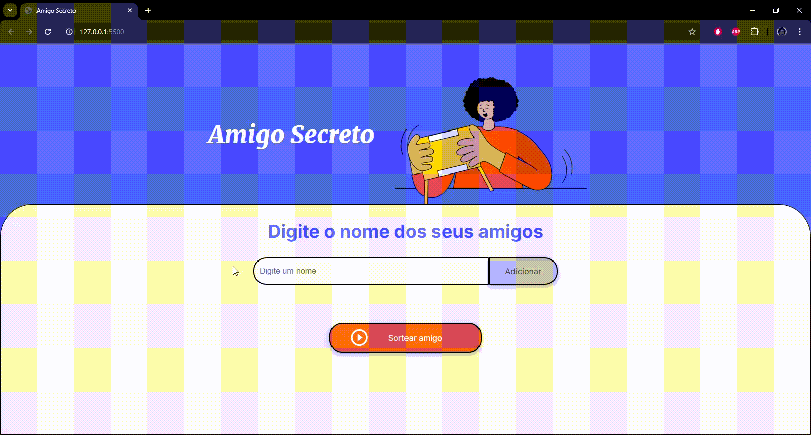

# Sistema de Sorteio de Amigo Secreto

## 1. Descrição do Projeto
Este projeto é um sistema para facilitar o sorteio de nomes em uma atividade de amigo secreto. Ele permite ao usuário cadastrar nomes, visualizar a lista de participantes e realizar o sorteio. Foi criado como parte do **desafio da Oracle Next Education em parceria com a Alura**.

**Objetivo:** Automatizar o sorteio de nomes para atividades de amigo secreto.  
**Problema Resolvido:** Elimina a necessidade de realizar o sorteio manual, tornando a tarefa mais prática e organizada.

---

## 2. Funcionalidades
- **Cadastro de amigos:** Insira os nomes dos participantes diretamente no sistema.
- **Validação de nomes:** Evita a adição de nomes duplicados e alerta para campos vazios.
- **Visualização da lista:** Exibe os nomes cadastrados.
- **Sorteio do amigo secreto:** Gera aleatoriamente o nome de um participante.
- **Atalhos do teclado:** Pressione a tecla **Enter** para adicionar um nome rapidamente.

---

## 3. Tecnologias Utilizadas
O projeto foi desenvolvido utilizando as seguintes tecnologias:
- **HTML:** Para estruturação do conteúdo.
- **CSS:** Para estilização e design responsivo.
- **JavaScript:** Para manipulação de eventos e lógica de funcionamento.

---

## 4. Pré-requisitos e Instalação
Siga os passos abaixo para rodar o projeto localmente:

1. **Clone o repositório:**
   ```bash
   git clone https://github.com/danbaziewicz/challenge-amigo-secreto.git
   ```
2. **Acesse o diretório do projeto:**
   ```bash
   cd challenge-amigo-secreto
   ```
3. **Abra o arquivo index.html em seu navegador:**
   ```bash
   start index.html
   ```
   Ou abra manualmente através do explorador de arquivos.
## 5. Demonstração
<p align="center"> 

</p>

## 6. Estrutura do projeto:
O projeto possuí a seguinte estrutura:
   ```bash
  ├── index.html       # Estrutura do conteúdo
  ├── style.css        # Estilização e design
  ├── script.js        # Lógica do sistema
  └── README.md        # Documentação
   ```
## 7. Autor
- [LinkedIn](https://www.linkedin.com/in/danbaziewicz/)
<table align='left'>
  <tr>
    <td align="center"><a href="https://github.com/danbaziewicz"><br /><sub><b>Danylo Baziewicz</b></sub></a><br /><a href="https://github.com/danbaziewicz" title="Danylo"></a></td>
  </tr>
</table>
